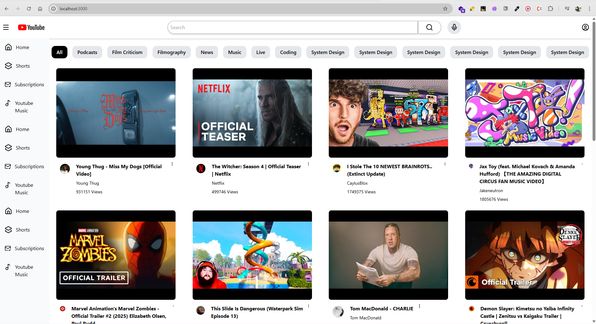

# Youtube Clone

### Features
- Search videos using debouncing
- Integration with the official YouTube API for Home Page Video and others
- VideoPlayer Integration

### Tech Stack
- React
- Redux Toolkit
- Tailwind CSS
- React Router
- Webpack

### Setup 
- Clone the repository
- Run npm install to install all dependencies
- Create a .env file in the root directory and add your YouTube API key
- Run npm start to start the development server

